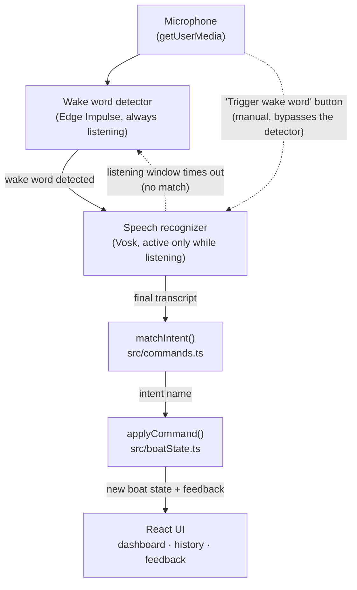
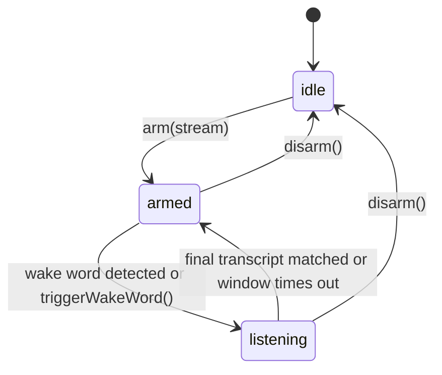

# Zenira — voice pipeline demo

Browser demo of the voice-control pipeline from [MCV25](https://github.com/ZeniteSolar/MCV25)
("Zenira"), the offline wake-word + speech-to-text module built for
ZeniteSolar's solar-powered boat. The production module runs on a
Raspberry Pi in C/C++ (CMake, Edge Impulse SDK for the wake word, Vosk for
transcription). This repo re-implements the same pipeline shape to run
**entirely client-side in the browser**, using the same two ML engines
exported to WebAssembly. No audio ever leaves the visitor's device.

This repository is public: the Vosk and Edge Impulse model files are too
large to commit (~79MB combined) and are instead distributed as GitHub
Release assets, which only resolve for unauthenticated requests — the
browser's, on every page load — when the hosting repo is public. See
[Deploy](#deploy) for the full reasoning.

## Features

- Bilingual (Portuguese / English) voice command grammar covering speed,
  direction, power/engine controls, and telemetry queries.
- Live wake-word confidence meter and raw microphone waveform, so it's
  obvious whether audio is actually being captured before suspecting the
  recognition engines.
- A simulated boat dashboard (speed gauge, rudder indicator, battery/engine
  telemetry) driven entirely by recognized voice commands.
- A command history log and a searchable command-library reference, so a
  visitor can see exactly what phrasing is recognized before trying it.
- Light/dark theme, and a mobile-first responsive layout distinct from the
  desktop multi-panel view.

## Architecture

Framework-free core + thin web UI, split so the pipeline logic is testable
without a browser and without either ML engine actually running.

- `src/` — the pipeline itself: a state machine (`idle` → `armed` →
  `listening`) plus intent matching, written against
  `WakeWordDetector` / `SpeechRecognizer` interfaces (`src/types.ts`) so it
  doesn't care whether those are backed by real WASM models or test
  doubles. Tested with Vitest (`npm test`), no browser required.
- `web/` — Vite + React app that renders pipeline state and requests mic
  access. It wires the pipeline to either the mocked engines
  (`src/mock/mockEngines.ts`) or the real ones
  (`web/src/engines/edgeImpulseWakeWord.ts`,
  `web/src/engines/voskRecognizer.ts`), switched independently by the
  `usingRealWakeWord` / `usingRealSpeechRecognizer` flags in
  `web/src/engines/index.ts`. Both are `true` in this deployment — both
  real engines are wired in. `web/src/audioGraph.ts` gives them (and the
  mic level meter) a single shared `AudioContext`/`MediaStreamAudioSourceNode`
  per stream — handing each consumer its own was an actual source of "the
  mic isn't being captured" bugs during development.

Wake-word detection starts automatically as soon as the pipeline is armed.
A manual "Trigger wake word" button in the UI stays available alongside it,
as a fallback for demoing the rest of the pipeline without relying on the
classifier picking up the room's actual audio.

### Pipeline flow

How audio and data actually move through the system, from the microphone to
a recognized command reaching the UI. The dotted edges are the two
"nothing matched" escape hatches: a manual trigger that skips the wake-word
classifier entirely, and a listening window that times out back to the
detector instead of hanging forever waiting for speech that isn't coming.



The same behavior, seen instead as `ZeniraPipeline`'s own state machine
(`src/pipeline.ts`) — `idle` only while unarmed, then bouncing between
`armed` (wake word running) and `listening` (Vosk running) for as long as
the mic is granted:



## Wiring in the real engines

### Wake word (Edge Impulse, MCV25's "Zenira" model)

`EdgeImpulseWakeWordDetector` (`web/src/engines/edgeImpulseWakeWord.ts`)
loads the WASM classifier exported from Edge Impulse Studio. Two things
to get right when re-exporting or swapping models:

- In Studio's **Deployment** tab, the target must be **WebAssembly**
  (plain, not the `[Browser, SIMD]` / `[Node, SIMD]` variants — those
  need different glue). That target's zip contains a `browser/` folder
  with `edge-impulse-standalone.js` + `.wasm` + `run-impulse.js` ready to
  use as-is. The **C++ library** export (`edge-impulse-sdk/`,
  `tflite-model/`, `trained.tflite`) is a different target entirely and
  won't run in a browser without compiling it yourself.
- Copy those three files straight into `web/public/models/` (flat, no
  subfolder — same place the Vosk models live, gitignored).
  `web/src/engines/edgeImpulseClassifier.ts` loads them as classic
  `<script>` tags (the Emscripten output isn't an ES module, so it can't be
  `import`ed through Vite).
- `HOP_SAMPLES`, `WAKE_LABEL`, and `CONFIDENCE_THRESHOLD` in
  `edgeImpulseWakeWord.ts` are read off the impulse's own
  `deployment-metadata.json` (window/hop size in ms × 16kHz, the wake
  word's class label, and the learn block's confidence threshold) — update
  them if you retrain with different windowing or class names.

### Speech-to-text (Vosk, Portuguese + English)

`vosk-browser` is installed and `VoskSpeechRecognizer`
(`web/src/engines/voskRecognizer.ts`) is wired in. A language picker in
the UI lets the user choose PT or EN before arming — Vosk has no single
bilingual model, so each language is a separate model loaded on demand
and cached.

`vosk-browser` expects each model as a gzipped tar archive of a directory
named `model/` with the standard Kaldi layout (`model/am/final.mdl`,
`model/conf/{mfcc,model}.conf`, `model/graph/...`, `model/ivector/...`).
The models downloaded directly from
[alphacephei.com/vosk/models](https://alphacephei.com/vosk/models) don't
match that shape out of the box, so they need repackaging:

```bash
# vosk-model-small-en-us-0.15 already has the am/conf/graph/ivector
# layout — just re-root it under a "model/" folder and tar it:
mkdir -p build-en/model && cp -r vosk-model-small-en-us-0.15/* build-en/model/
tar -czf vosk-model-small-en-us-0.15.tar.gz -C build-en model

# vosk-model-small-pt-0.3 is an older, flat "Android" layout with no
# conf/model.conf — reshuffle its files into am/conf/graph(/phones)/ivector
# and hand-write conf/model.conf (silence-phones range comes from the
# model's own phones.txt: SIL/SIL_*/GBG/GBG_* occupy ids 1-10).
```

The resulting `vosk-model-small-pt-0.3.tar.gz` and
`vosk-model-small-en-us-0.15.tar.gz` (~30-40MB each) live in
`web/public/models/`, gitignored (too large for the repo) — regenerate
them with the steps above, or fetch pre-packaged copies, before running
`npm run dev` / `npm run build` in `web/`. Only the small models are
shipped; the 1.8GB full models aren't practical for the browser.

### Where the model files live

Both engines' model files (`vosk-model-small-pt-0.3.tar.gz`,
`vosk-model-small-en-us-0.15.tar.gz`, `edge-impulse-standalone.js`,
`edge-impulse-standalone.wasm`, `run-impulse.js`) are gitignored — ~79MB
combined, too large to commit. `web/src/modelsBaseUrl.ts` resolves where to
fetch them from at runtime:

- **Local dev**: defaults to `/models`, i.e. `web/public/models/` — drop
  the five files there yourself (steps above).
- **Deployed build**: defaults to `/api/models`, an Edge Function
  (`api/models/[...path].js`) that fetches the file from a GitHub Release
  and streams it back, rather than served from `web/public/models/` (which
  isn't in the deployed build at all, being gitignored). `vercel.json` also
  rewrites `/models/...` to that same function as a convenience alias, but
  the app doesn't depend on the rewrite working — it points at `/api/models`
  directly. See [Deploy](#deploy) for why it's a proxying function and not
  just a redirect to `github.com`.

### End state

With both engines wired in, the whole pipeline — wake word detection and
transcription — runs in the visitor's browser; no audio is sent to any
server. That's called out on the demo page itself, in the status note
under the transcript.

## Legal note

- The Edge Impulse SDK is BSD-3-Clause-Clear; the trained model ("Output")
  is owned by the account that trained it, and WebAssembly is one of Edge
  Impulse's own supported deployment targets — publishing your own export
  is the intended use of the feature, not a gray area. Free-tier projects
  are private by default, so nothing is exposed unless you opt in.
- Vosk models are Apache-2.0 (Copyright Alpha Cephei Inc.) — no
  restriction on redistribution.

## Deploy

Deployed on Vercel, linked from the portfolio's Work section rather than
bundled into it. `vercel.json` at the repo root builds from `web/`
(`cd web && npm install && npm run build`, output `web/dist`) and sets the
`Cross-Origin-Opener-Policy` / `Cross-Origin-Embedder-Policy` headers Vosk's
WASM build needs — matching the headers `web/vite.config.ts` already sets
for local dev.

Since the model files aren't in git (see above), a Vercel build needs them
served from somewhere. Using a GitHub Release on this repo:

1. Locally, make sure `web/public/models/` has all five files (see
   "Where the model files live" above).
2. Create a release and upload them as assets:
   ```bash
   gh release create models-v1 \
     web/public/models/vosk-model-small-pt-0.3.tar.gz \
     web/public/models/vosk-model-small-en-us-0.15.tar.gz \
     web/public/models/edge-impulse-standalone.js \
     web/public/models/edge-impulse-standalone.wasm \
     web/public/models/run-impulse.js \
     --title "Model files v1" \
     --notes "Vosk PT/EN + Edge Impulse WASM build, not checked into git (see README)."
   ```
   No `gh` CLI? Same result via the web UI: repo → **Releases** → **Draft a
   new release** → tag `models-v1` → drag all five files into the assets
   box → **Publish release**. The repo hosting the release must be
   **public** — private-repo release assets 404 for an unauthenticated
   request, which is exactly what a visitor's browser makes. This is why
   this repository is public rather than private.
3. `web/src/modelsBaseUrl.ts` points production builds at `/api/models`, an
   Edge Function (`api/models/[...path].js`) whose `RELEASE_BASE` constant
   points at that release's asset base URL — update it there when you bump
   the release. It has to be a proxying function, not a plain rewrite
   straight to `github.com`, for two stacked reasons:
   - The site sets `Cross-Origin-Embedder-Policy: require-corp` (Vosk's
     WASM build needs cross-origin isolation), which makes the browser
     silently block any cross-origin subresource that doesn't send a
     `Cross-Origin-Resource-Policy`/CORS header — and GitHub's
     release-asset CDN sends neither.
   - A `vercel.json` rewrite straight to the GitHub URL doesn't dodge that
     either: GitHub's download URL itself 302s to Azure Blob Storage, and
     Vercel forwards that redirect to the browser rather than resolving it
     — so the browser ends up following the redirect itself, landing back
     on a cross-origin, COEP-blocked URL.

   The Edge Function sidesteps both: it fetches the release asset
   server-side (resolving the redirect there, invisible to the browser)
   and streams the response back from the site's own origin. Leave
   `VITE_MODELS_BASE_URL` unset in Vercel — its default (`/api/models`) is
   the function itself; setting it to the GitHub URL directly brings the
   COEP block back.
4. Redeploy. Bumping a model later means uploading a new release (a new
   tag, e.g. `models-v2`) and updating `RELEASE_BASE` in
   `api/models/[...path].js` — GitHub releases are immutable once
   published, so re-uploading under the same tag isn't an option.

Re-exporting or retraining a model doesn't require touching the rest of
the app code, only a new release + that one constant.

## Commands

```bash
npm install         # core deps, at repo root
npm test            # vitest, core pipeline + intent matching
npm run test:watch  # vitest, watch mode
npm run typecheck

cd web
npm install
npm run dev          # local dev server
npm run build         # type-check + production build
npm run preview        # preview a production build locally
npm run lint            # oxlint
```
